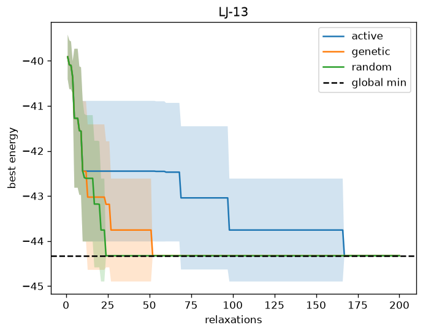
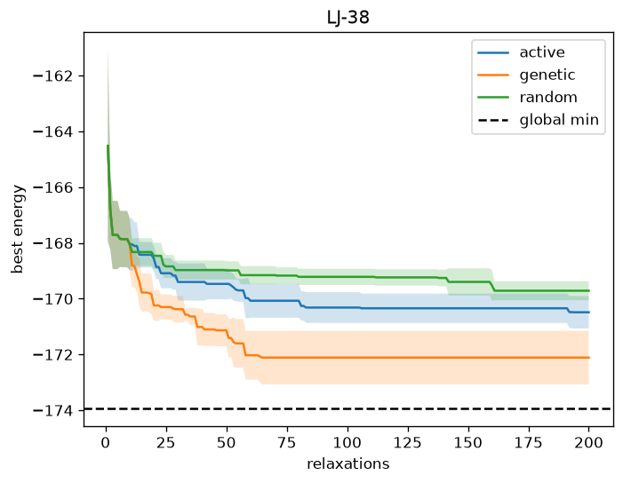
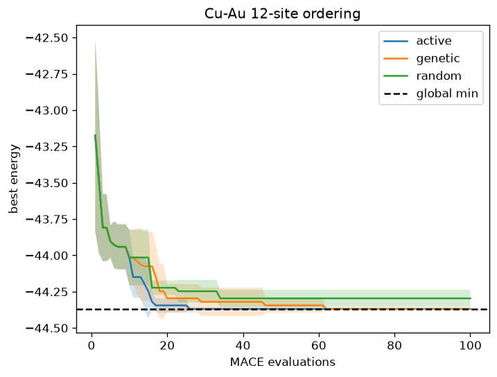

# ⚛️ ATOMICA

> An AI-guided scientific-discovery loop for atomic systems — where every claim is backed by measurable, reproducible computation, never by the AI's say-so.


ATOMICA asks a single, cheat-proof question and answers it with numbers you can check: **under an equal compute budget, can AI/ML-guided search find good atomic configurations faster than classical baselines?** It is built in slices — each one a small, self-contained, measurable result.

---

## ✨ Highlights

- 🧪 **Slice 1 — toy potential:** AI-guided search **loses** to a genetic baseline. An honest negative result.
- 🔬 **P2 — real ML potential (MACE):** on a Cu-Au alloy-ordering problem, AI-guided search **wins** — fewer evaluations, higher hit rate.
- 🎯 Every result is validated against **ground truth** (known global minima / brute force), so "it worked" is never a matter of opinion.
- 🚫 No LLM in the loop yet — the trustworthy computational core comes first (see [Roadmap](#-roadmap)).

---

## 🧭 The idea

The long-term vision is a system that reads scientific literature, proposes hypotheses about atomic structures, runs reproducible experiments to test them, criticizes its own conclusions, and decides what to investigate next — with a human as supervisor, not operator.

That full vision is **not** what this repo is yet. It's deliberately broken into slices, each producing a working, measurable result on its own.

---

## 🧪 Slice 1 — Does AI-guided search beat classical baselines?

**Problem:** Lennard-Jones cluster global-minimum search — place *N* atoms to minimize total LJ energy. Known global minima (Cambridge Cluster Database) give the ground truth. Runs on a laptop, reduced units (ε = σ = 1), no LLM.

Three strategies compete under an equal budget of local relaxations, differing only in *how they use past evaluations*:

| Method | Memory of past evaluations |
|--------|----------------------------|
| **Random** | None |
| **Genetic** | Implicit — population + cut-and-splice crossover + selection |
| **Active-learning** | Explicit — a RandomForest surrogate over a distance-histogram descriptor picks where to look next |

**Results** (`N ∈ {13, 38}`, 5 seeds, budget = 200 relaxations):

- **LJ-13** — every method finds the global minimum (−44.326801); active-learning ties on quality but converges slower (~165 relaxations vs ~25–50).
- **LJ-38** — a hard funnel; nobody reaches the true minimum (−173.928427) within budget:

| Method | mean best | best of 5 | gap to true min |
|--------|----------:|----------:|----------------:|
| 🥇 Genetic | −172.11 | −173.13 | 1.82 |
| Active-learning | −170.49 | −171.16 | 3.44 |
| Random | −169.71 | −170.21 | 4.21 |




**❌ Verdict:** active-learning, as specified, does **not** beat the baselines here — a real, reported-as-is negative result. Likely causes: the distance-histogram descriptor is lossy and the acquisition is untuned. Fixing that is future work, not a Slice 1 goal.

---

## 🔬 P2 — Cu-Au alloy ordering, with a real ML potential

**Problem:** swap the toy potential for **MACE-MP-0** (`mace-torch`) and ask the same question on a real materials problem — on a fixed 12-site Cu-Au FCC lattice (6 Au, 6 Cu, only the *arrangement* varies), find the lowest-energy ordering under an equal MACE-evaluation budget.

Because there are only C(12,6) = 924 configurations, **ground truth is brute-forced** with the real potential — every ordering evaluated once and cached.

```bash
python3 -m atomica.run_alloy --budget 100 --seeds 5 --out results/alloy
```

**Result** — brute-forced global minimum **−44.36847 eV**, config `[0, 1, 4, 5, 8, 9]`:

| Method | mean best | success rate | mean evals-to-target |
|--------|----------:|:------------:|---------------------:|
| 🥇 Active-learning | −44.36847 | 5/5 (100%) | **17.2** |
| Genetic | −44.36847 | 5/5 (100%) | 26.8 |
| Random | −44.29604 | 2/5 (40%) | 28.5 |



**✅ Verdict:** active-learning **wins** — reaches the true ground state every seed, in the fewest evaluations. The opposite of Slice 1: on a real potential with a small, cheat-proof search space, the surrogate delivers a genuine, measured speedup.

> 🧲 **Physics check:** the ground state is a pure **L1₀ layering** (alternating Cu / Au (100) planes) — exactly the real CuAu-I ordered intermetallic. A reassuring sanity check on the MACE potential.

---

## 🚀 Quickstart

```bash
python3 -m pip install -r requirements.txt   # Python 3.13; ase, matplotlib, numpy, scipy, scikit-learn, mace-torch
```

```bash
# Slice 1 — LJ cluster search
python3 -m atomica.run --n 13 38 --budget 200 --seeds 5 --out results/lj

# P2 — Cu-Au alloy ordering (real MACE)
python3 -m atomica.run_alloy --budget 100 --seeds 5 --out results/alloy

# Tests
python3 -m pytest -q
```

> Tip: give the two CLIs separate `--out` directories (as above); both default to `results/`, so sharing it makes each regenerate the other's figures.

---

## 🗂️ Project layout

```
atomica/
├── potential.py      # ASE Lennard-Jones calculator + local relaxation (swap point for real ML potentials)
├── descriptor.py     # pairwise-distance histogram (permutation/rotation/translation invariant)
├── search.py         # random / genetic / active-learning — shared signature, shared budget
├── benchmark.py      # runs method × seed × N, logs reproducible per-run JSON
├── plot.py           # convergence curves + success-rate / evals-to-target metrics (shared)
├── run.py            # CLI — Slice 1 (LJ clusters)
├── alloy.py          # MACE-MP-0 evaluate on a fixed Cu-Au FCC lattice, SRO descriptor, brute-force ground truth
├── alloy_search.py   # random / genetic / active-learning over Au/Cu orderings (composition-preserving)
└── run_alloy.py      # CLI — P2 (Cu-Au alloy ordering)
```

Design specs and implementation plans live under [`docs/superpowers/`](docs/superpowers/).

---

## 🗺️ Roadmap

The computational core comes first; LLM work is deliberately last — it has the lowest measurability and the highest risk of looking impressive while meaning nothing.

| Phase | Adds | Status |
|-------|------|:------:|
| **P1** | Search benchmark on a toy LJ potential | ✅ done |
| **P2** | Real ML potential (MACE-MP-0) on a Cu-Au alloy-ordering problem | ✅ done |
| **P3** | An LLM *strategist* that reads results and proposes the next experiment (never touches the physics) | ⏳ next |
| **P4** | An LLM *critic* proposing control / falsification experiments | 🔒 planned |
| **P5** | A literature agent (paper → gaps → hypotheses) feeding P3 | 🔒 planned |

---

## 📄 License

[MIT](LICENSE) © 2026 Chayanun Yuvanaboon
